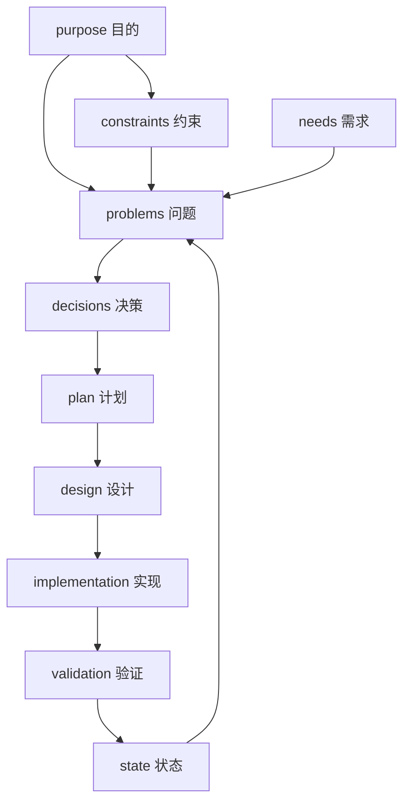

# Development Governance

这套结构是项目的 repo 内开发操作系统。

目标不是沉淀大而全的过程文件，而是为人类和 AI 提供一套稳定、可执行、可追溯的工作接口。

这套结构要求每一层都回答五个问题：

- 这一层是什么
- 这一层的输入是什么
- 这一层的输出是什么
- 这一层禁止做什么
- 进入下一层的条件是什么

## 分层总图

## 目录说明

### 稳定规则

这些文件描述工作协议，不记录某一轮具体实例：

- `AGENT_WORKFLOW.md`
- `layers/*.md`
- `templates/*.template.md`

### 实例记录

这些内容用于追溯某一轮真实演进：

- `records/`

每个值得追溯的变更，应在 `records/` 下建立独立目录。

### 临时产物

以下内容不应进入 repo 历史：

- AI scratch
- 中间分析
- 一次性日志
- 原始运行产物
- 候选废案

推荐本地使用：

- `.tmp/`
- `.work/`
- `artifacts/local/`

这些目录默认已加入 `.gitignore`。

## 使用方式

### 人类开发者

最小工作流：

1. 先读 `layers/purpose.md` 和 `layers/constraints.md`
2. 判断任务当前属于哪一层
3. 如果任务会影响行为、范围或结构，先在 `records/` 建实例记录
4. 只有问题、决策、计划清楚后，才进入实现
5. 实现结束后，补 `validation` 结论

### Commit 规范

提交信息使用统一格式：

- `[xxx] ...`

要求：

- 方括号内填写本次提交的类型或主题标签
- 方括号后接一个空格，再写简洁的提交说明
- 一个 commit 应对应一个清晰边界的变更，不要把多个不相关主题混在一起
- 当一轮工作已经形成清晰里程碑时，应及时提交，不要长时间堆积大量未提交改动

示例：

- `[feat] bootstrap PoCo feishu-first Python MVP scaffold`
- `[fix] correct task confirmation state transition`
- `[docs] add commit message convention to development docs`
- `[refactor] separate feishu gateway from task controller`

### AI

AI 必须把这里当成 repo 内的工作协议，而不是可选参考。

AI 在动代码前，至少应读取：

- `development/AGENT_WORKFLOW.md`
- `development/layers/purpose.md`
- `development/layers/constraints.md`

如果任务不是纯局部修正，AI 还应检查：

- 是否需要新建 `records/`
- 是否已有相关 `decision` / `plan` / `design`
- 当前任务是否具备进入实现层的条件

AI 在持续开发时，还必须遵守：

- 及时提交已经形成边界的工作，不把多个里程碑混在一个未提交工作区里
- 及时同步稳定文档和相关 `record`，不让代码状态长期领先于文档状态

## 最小工作流

### 路径 A：小范围修正

适用场景：

- 文案修复
- 显然正确的小 bug 修复
- 不改变对外行为边界的局部调整

要求：

- 仍需遵守 `purpose` 和 `constraints`
- 可以直接进入 `implementation`
- 结束后仍需补最小 `validation`

### 路径 B：值得追溯的演进

适用场景：

- 新功能
- 行为变化
- 边界变化
- 架构调整
- 跨模块改动

要求：

1. 先形成 `need` 或至少明确外部压力
2. 再形成 `problem`
3. 再形成 `decision`
4. 再形成 `plan`
5. 需要设计时补 `design`
6. 实现后补 `validation`

## 结构取舍

这套结构故意保持克制：

- 不引入额外平台
- 不要求复杂审批系统
- 不要求所有任务都写完整六件套记录

但有三条硬要求：

- 不能跳过目的和约束
- 不能把需求直接当问题
- 不能在没有边界的情况下直接实现
